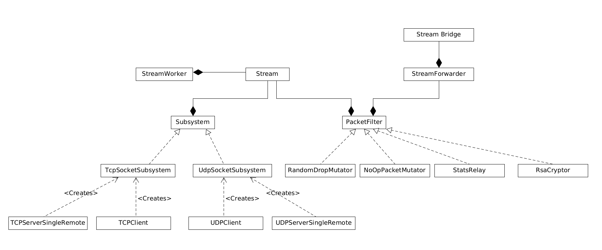
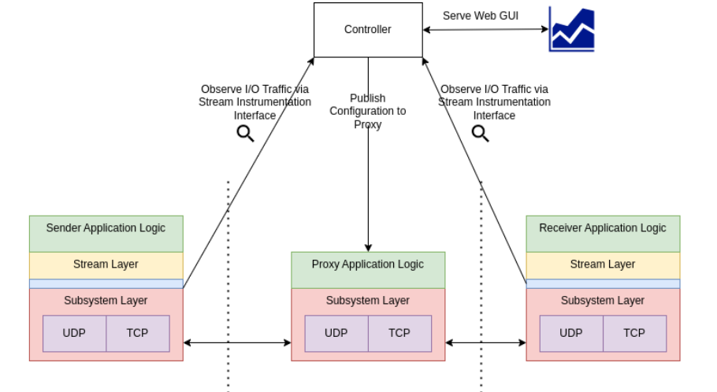
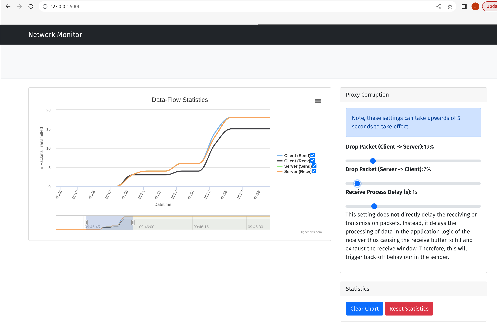

# securestream

This is an experimental project to implement a reliable stream-based protocol which
leverages RSA Public / Private Key cryptography to ultimately provide a secure & reliable two-way communication between two applications over a network. The stream can be established over
either UDP or TCP protocol.

The goal of this project is to learn more about network applicaiton development and network security.

The Stream protocol implements the following features:
 - Reliable data-transmission
 - Dynamically adjusting send and receive windows
 - Proxying & inspecting stream data (at the packet level) using a MITM application
 - RSA Data Dencryption to prevent packet introspection from a MITM proxy

## Design Overview

The TCP Sender / Proxy / Receiver design consists of the endpoints (Sender, Receiver, Proxy) applications, as
well as the controller application. The controller primary serves as a visual interface for studying the behaviours of the protocol and emulating different congestion conditions. The below sections will describe an overview of the endpoints and controller
designs.


### Endpoint Design
The TCP Sender/Proxy/Receiver application developed for this project models a stream-based transmission
protocol over either the TCP or UDP protocol (configurable by command line.) The software design is broken into
three layers, the Subsystem layer, Stream layer and the Application Logic layer.


### Subsystem Layer
The subsystem layer implements a packet-based communication using a custom Packet object (see Packet
object under Structures section.) The Subsystem essentially behaves as an abstraction of the Network layer in
the OSI model. Therefore, the packets modelled in the Subsystem layer are subject to loss, duplication, or delay.
In practice, such a phenomenon will only occur when the UDP implementation of the Subsystem layer is used or
the Proxy Application logic is configured to forcefully drop packets.
The interface presented by the Subsystem layer to application logic or the stream layer is an unreliable packet
based send / receive. In this project, there are two implemented subsystems, either can be used as a basis for
establishing a Stream connection.

### Stream Layer
The stream layer is established over the Subsystem layer and implements all protocol features necessary for a
reliable stream based connection. This includes acknowledging received data, establishing and dynamically
adjusting the send and receive window and buffering data for transmission and receiving.
The interface exposed by the Stream layer to the application layer is a reliable stream-based read / write. The
protocol implemented by the Stream layer is documented in the Protocol section.


## Components of System

### UML Diagram

The below UML diagram visualises the design & implementation as it pertains to the implementation of our
stream protocol. The subsequent section details the purpose of each component in this system and its
participation in supporting the endpoints (Sender, Receiver and Proxy.)
For implementation details of each component, refer to later sections.




## Controller
The controller component is responsible for monitoring and displaying statistics related to the behaviours of the
sender and receiver components, as well as injecting configuration parameters into the proxy (introducing packet
dropping etc.) Additionally, the controller can be used to configure an adjustable processing delay in the receiver.
This is accomplished by pulling and pushing data into the controller via REST endpoints.





### Web GUI

The controller hosts a web graphical user interface for interacting with the sender / receiever and proxy to emulate and monitor the effects of various different network congestion conditions. The below screenshot shows some network traffic.




## Application Usage
This python package comes with a few entrypoints.

### Sender
The sender component of this application transmits data from a file (or stdin) to a receiver component. Optionally, it can
be directed to transmit data through the proxy component by adjusting the host and port arguments on the sender.

Use `stream-sender --help` to see the self-documenting CLI:

```
usage: sender [-h] [--target-port TARGET_PORT] [--target TARGET] [--file FILE] [--controller CONTROLLER] [--udp] [--pub-key PUB_KEY] [--priv-key PRIV_KEY]

Transmits data to a server

options:
  -h, --help            show this help message and exit
  --target-port TARGET_PORT
                        The port to host the proxy service on.
  --target TARGET       The target port (where data is proxied to)
  --file FILE           Transmits the specified file. Otherwise, if argument not specified, enters text input mode from stdin where each newline triggers transmission of
                        one or more packets containing the contents defined.
  --controller CONTROLLER
                        URL to the controller in the form of http://<host>:port
  --udp                 Use UDP Subsystem instead of default TCP subsstem
  --pub-key PUB_KEY     Public key file to use for decrypting received data.
  --priv-key PRIV_KEY   Private key file, used for encrypting received data.

```

### Proxy
The proxy application proxies packets via two bridged subsystems, and doesn’t incorporate a stream. This is
accomplished using the SubsystemBridge implementation.

The proxy implements no part of the stream protocol, and only relays packets in-between the sender and receiver
and applies dropping logic per direction from the controller.

You can see the proxy CLI help interface by invoking the command `stream-proxy --help`

```
usage: proxy [-h] [--proxy-port PROXY_PORT] [--target-port TARGET_PORT] [--target TARGET] [--controller CONTROLLER] [--udp]

Proxy server for controlling data drop-rates.

options:
  -h, --help            show this help message and exit
  --proxy-port PROXY_PORT
                        The port to host the proxy service on.
  --target-port TARGET_PORT
                        The target port (where data is proxied to)
  --target TARGET       The target endpoint (where data is proxied to)
  --controller CONTROLLER
                        URL to the controller in the form of http://<host>:port
  --udp                 Use UDP Subsystem instead of default TCP subsystem
```

### Receiver

The receiver component establishes a stream connection with a client and then continuously reads from the
stream into stdout until terminated. Additionally, a processing delay can be injected into the receiver which will
emulate a “processing” delay in-between reading data off of the stream.

You can see the receiver CLI help interface by invoking the command `stream-receiver --help`

```
usage: receiver [-h] [--port PORT] [--controller CONTROLLER] [--udp] [--pub-key PUB_KEY] [--priv-key PRIV_KEY]

Receiver server for collecting data from a sender.

options:
  -h, --help            show this help message and exit
  --port PORT           The listen port for the file reciever
  --controller CONTROLLER
                        URL to the controller in the form of http://<host>:port
  --udp                 Use UDP Subsystem instead of default TCP subsystem
  --pub-key PUB_KEY     Public key file to use for decrypting received data.
  --priv-key PRIV_KEY   Private key file, used for encrypting received data.
```


### Generating RSA Public / Private Keys

A RSA public and private key, compatible with this applicaiton, can generated using the command `stream-rsagen`

This will produce a public and private key pair in the working directory, named as 'public.key' and 'private.key' respectively.

These keys can be used with the Stream API using `create_cryptor` (see `sender.py` as example). Otherwise, these keys can be used with the
sender and receiver applications by using the `--pub-key` or `--priv-key` switches.


## Stream API Usage

The stream protocol is easy to use, refer to `sender.py`, `receiver.py` and `proxy.py` for example code of usage. `proxy.py` shows how to implement packet level application logic, where as `sender.py` and `receiver.py` give examples of interacting with the stream.

1. First, establish a subsystem you want to use. The available subsystem factories are as follows:
   - TcpServerSingleRemote
   - TcpClient
   - UdpServerSingleRemote
   - UdpClient

   For example usage of `TcpServerSingleRemote` or `TcpClient` refer to `sender.py` in the source directory

2. Establish a Stream overtop. Optionally, you can apply packet filters to introduce RSA Encryption, or to simulate dropping packets.


### Example

#### Client
A simple example of a TCP Client using RSA cryptography:

```
def create_stream(subsystem: Subsystem, pub_key: str = None, priv_key: str = None):
    send_stat = NoOpPacketMutator()
    recv_stat = NoOpPacketMutator()

    if pub_key:
        recv_stat = build_cryptor(pub_key)

    if priv_key:
        send_stat = build_cryptor(priv_key)

    return Stream(subsystem, transmit_filter=send_stat, recv_filter=recv_stat)

args = ...

if args.udp:
  client = UdpClient(
      args.target,
      args.target_port
  )
else:
  client = TcpClient(
      args.target,
      args.target_port
  )

with client as client_subsystem:
    with create_stream(client_subsystem, "public.key", "private.key") as client_stream:
       for l in sys.stdin:
           print("Writing: " + l)
           client_stream.write(l.encode("utf-8"))

```

#### Server

The corresponding server implementation for the above client might be as follows:

```


def create_stream(subsystem: Subsystem, pub_key: str = None, priv_key: str = None):
    transmit_filter = NoOpPacketMutator()
    recv_filter = NoOpPacketMutator()

    if pub_key:
        recv_filter = build_cryptor(pub_key)

    if priv_key:
        transmit_filter = build_cryptor(priv_key)

    return Stream(subsystem, transmit_filter=transmit_filter, recv_filter=recv_filter)

args = ...

if args.udp:
  server = UdpServerSingleRemote(
      args.port
  )
else:
  server = TcpServerSingleRemote(
      args.port
  )

with server as server_subsystem:
  with create_stream(server_subsystem, args.pub_key, args.priv_key) as server_stream:
      while server_stream.is_open():
          with os.fdopen(sys.stdout.fileno(), "wb", closefd=False) as stdout:
              stdout.write(server_stream.read(1))
              stdout.flush()

```